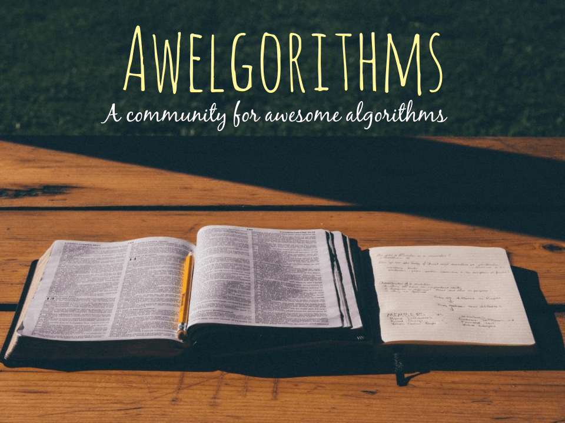

#Awelgorithms

Hello there! You must have landed here coz you're passionate about writing algorithms, like us. Even if you aren't, you would love it. Welcome to Awelgorithms, we're an Open-Source community of passionate programmers that help each other to better each other and learn from each other. 

TODO :
1) dont be pampered by the compiler, use pen and paper, thats what you have to do in interviews anyway, practice crafting algorithms on paper, you might feel lost at first, but your mind will evolve into thinking like a compiler with right amount of time and practice. it's hard, but totally worth it. unlock all your mind chakras and harness the power of the human mind.

 pencil + paper + mind = Awelgorithms. 

# Awelgorithms Guidelines 

*1) Be very descriptive, this repository is home to lots of awesome algorithms ranging from beginner to advanced difficulties. Explain the algorithm that you solved with comments, explanation, diagrams or whatever to help the newbie programmers understand it without any hassle, like you were explaining a 5 year old kid (ELI5). Remember, we're a community that help each other, you're a teacher to the ones that need help and vice versa.*

*2) If you come across a problem somewhere, make sure you mention that.For ex, if you came across a problem from a book, mention that book.*

3)  